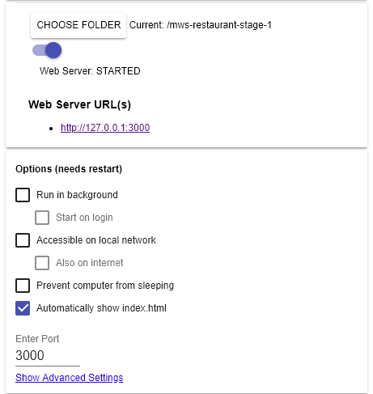

# Mobile Web Specialist Certification Course
---
#### _Three Stage Course Material Project - Restaurant Reviews_

## Project Overview: Stage 1

For the **Restaurant Reviews** projects, you will incrementally convert a static webpage to a mobile-ready web application. In **Stage One**, you will take a static design that lacks accessibility and convert the design to be responsive on different sized displays and accessible for screen reader use. You will also add a service worker to begin the process of creating a seamless offline experience for your users.

### How To View This Project

1. Download the project, and start up a simple HTTP server to serve up the site files on your local computer. [Web Server for Chrome](https://chrome.google.com/webstore/detail/web-server-for-chrome/ofhbbkphhbklhfoeikjpcbhemlocgigb?hl=en) is easy to install and launch.  Once launched, choose the project folder and start the web server.

   

2. With the server running, visit the site: `http://localhost:3000`

## Project ADDENDUM:

This repository is using [leafletjs](https://leafletjs.com/) with [Mapbox](https://www.mapbox.com/) jpg tiles optimized with quality:70.
I replaced <your MAPBOX API KEY HERE> with my token from [Mapbox](https://www.mapbox.com/).

---